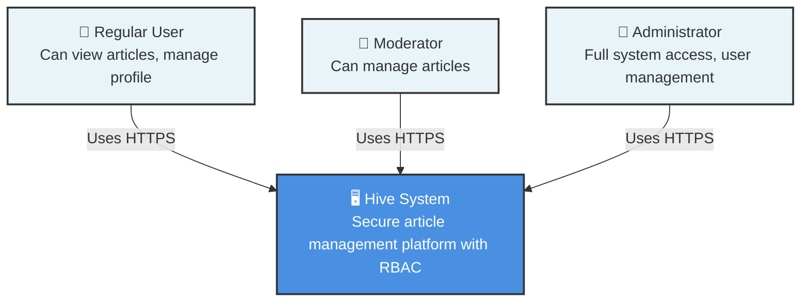

# C4 Level 1: System Context

## Overview

This diagram shows the Hive system and its relationships with users and external systems.

## Diagram

## Actors

### Regular User
- **Purpose**: Standard user accessing public content
- **Capabilities**:
  - View articles
  - Manage personal profile
  - Create/edit own content (if permitted)
- **Authentication**: JWT-based authentication required for protected actions

### Moderator
- **Purpose**: Content management role
- **Capabilities**:
  - All Regular User capabilities
  - Create, update, delete articles
  - Manage article content
- **Authentication**: JWT-based authentication with Moderator role

### Administrator
- **Purpose**: Full system administration
- **Capabilities**:
  - All Moderator capabilities
  - User management (create, update, delete users)
  - Role assignment and modification
  - System configuration access
- **Authentication**: JWT-based authentication with Admin role

## System Responsibilities

The Hive system provides:
- **Article Management**: CRUD operations for articles with role-based access control
- **User Management**: Registration, authentication, and role-based authorization
- **Security**: JWT-based authentication, HttpOnly cookies, rate limiting, security headers
- **API**: RESTful API with OpenAPI/Swagger documentation

## Technology Stack

- **Frontend**: React 19 with Redux Toolkit
- **Backend**: Flask (Python 3.11)
- **Database**: MongoDB
- **Authentication**: JWT (access + refresh tokens)
- **Deployment**: Docker containers

