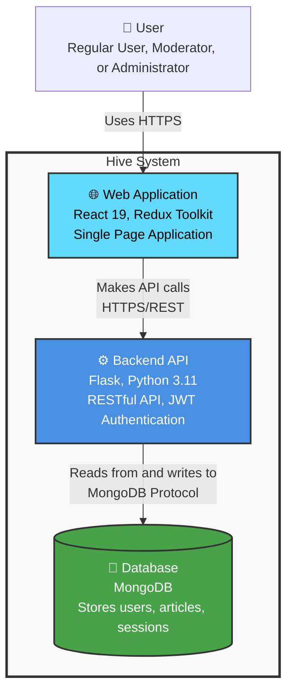

# C4 Level 2: Container Diagram

## Overview

This diagram shows the high-level technical building blocks (containers) that make up the Hive system.

## Diagram

## Containers

### Web Application (React Frontend)

**Technology**: React 19, Redux Toolkit, React Router v7, Axios, Tailwind CSS

**Responsibilities**:
- User interface rendering
- Client-side routing and navigation
- State management (auth, user sessions, articles)
- Token management and automatic refresh
- Role-based UI rendering
- Protected route enforcement

**Key Features**:
- Multi-tab session coordination
- Automatic token refresh via Axios interceptors
- Error boundaries for graceful degradation
- Security-first UI (elements hidden based on permissions)

**Deployment**: Docker container, served via static files or CDN

### Backend API (Flask)

**Technology**: Flask, Python 3.11, PyMongo, Pydantic, JWT-Extended, Bcrypt

**Responsibilities**:
- Request handling and routing
- Authentication and authorization (JWT, RBAC)
- Business logic execution
- Input validation (Pydantic schemas)
- Rate limiting
- Security headers enforcement
- Error handling and logging

**Key Features**:
- Clean Architecture: Routes → Services → Repositories
- Application Factory pattern
- Centralized error handlers
- HttpOnly cookie-based token storage
- OpenAPI/Swagger documentation at `/api/docs`

**Deployment**: Docker container, stateless (scalable horizontally)

### Database (MongoDB)

**Technology**: MongoDB

**Responsibilities**:
- Persistent data storage
- User accounts and profiles
- Articles and content
- Refresh token storage
- Session data

**Collections**:
- `users`: User accounts, roles, credentials
- `articles`: Article content, metadata
- `refresh_tokens`: Active refresh tokens (optional, can be stateless)

**Deployment**: MongoDB instance (can be containerized or managed service)

## Communication Flows

1. **User Authentication Flow**:
   - User submits credentials via Web App
   - Web App → API: POST `/api/login`
   - API validates credentials, generates JWT tokens
   - API sets HttpOnly cookies with tokens
   - API → Web App: Success response

2. **Article Retrieval Flow**:
   - User requests articles via Web App
   - Web App → API: GET `/api/articles?page=1&limit=10`
   - API → Database: Query articles collection
   - Database → API: Article documents
   - API → Web App: JSON response with articles

3. **Token Refresh Flow**:
   - Web App detects access token expiration
   - Web App → API: POST `/api/refresh` (with refresh token cookie)
   - API validates refresh token, generates new access token
   - API → Web App: New tokens in HttpOnly cookies

## Security Considerations

- **HTTPS**: All communication encrypted in production
- **HttpOnly Cookies**: Tokens stored in HttpOnly cookies to prevent XSS
- **CORS**: Configured for frontend origin only
- **Rate Limiting**: Applied at API level, stricter on auth endpoints
- **Security Headers**: CSP, X-Frame-Options, X-Content-Type-Options set by API

