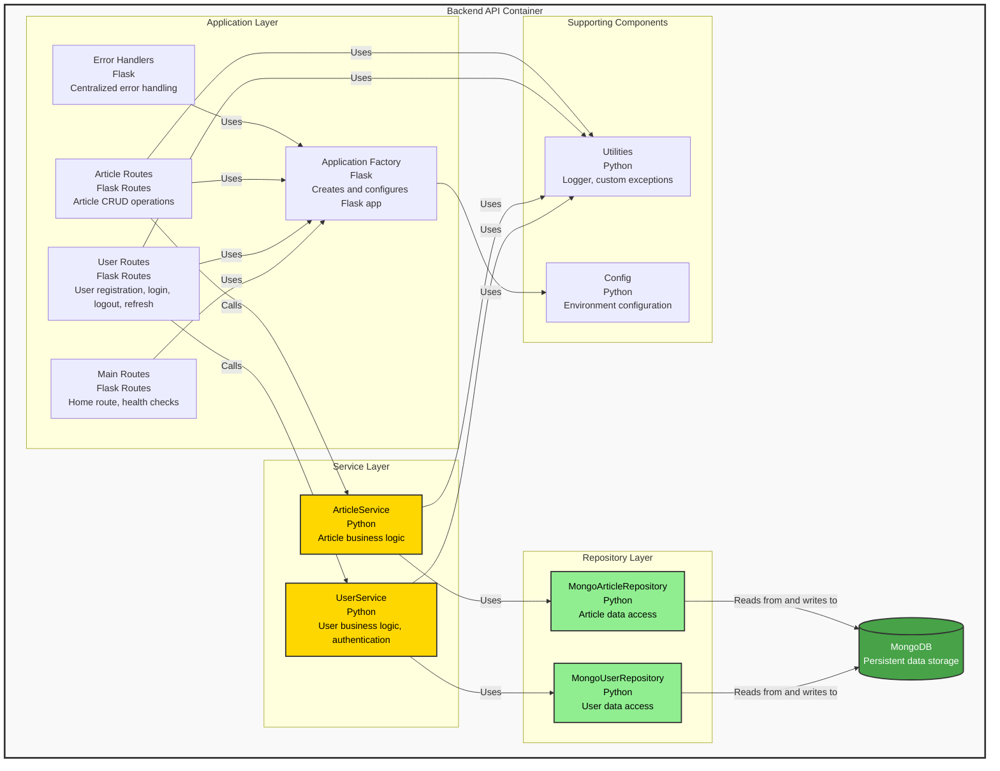

# C4 Level 3: Backend Components

## Overview

This diagram shows the components within the Backend API container and their relationships.

## Diagram

## Components

### Application Layer

#### Application Factory (`app/__init__.py`)
- **Purpose**: Creates and configures Flask application instance
- **Pattern**: Application Factory Pattern
- **Responsibilities**:
  - Initialize Flask app
  - Register blueprints (routes)
  - Configure error handlers
  - Set up JWT configuration
  - Apply security headers middleware
  - Configure CORS

#### Main Routes (`app/routes/main_routes.py`)
- **Purpose**: Public routes (no authentication required)
- **Endpoints**:
  - `GET /`: Welcome message
  - Health check endpoints (if implemented)

#### User Routes (`app/routes/user_routes.py`)
- **Purpose**: User authentication and management endpoints
- **Endpoints**:
  - `POST /api/register`: User registration
  - `POST /api/login`: User authentication
  - `POST /api/logout`: User logout
  - `POST /api/refresh`: Token refresh
  - `GET /api/protected`: Protected endpoint example
  - `GET /api/users`: List users (Admin only)
  - `PUT /api/users/<user_id>`: Update user (Admin only)
  - `DELETE /api/users/<user_id>`: Delete user (Admin only)
- **Security**: JWT authentication, RBAC enforcement

#### Article Routes (`app/routes/article_routes.py`)
- **Purpose**: Article management endpoints
- **Endpoints**:
  - `GET /api/articles`: List articles (paginated)
  - `POST /api/articles`: Create article (authenticated)
  - `GET /api/articles/<article_id>`: Get article by ID
  - `PUT /api/articles/<article_id>`: Update article (authenticated)
  - `DELETE /api/articles/<article_id>`: Delete article (authenticated)
  - `GET /api/articles/search`: Search articles
- **Security**: JWT authentication, role-based permissions

#### Error Handlers (`app/error_handlers.py`)
- **Purpose**: Centralized error handling
- **Responsibilities**:
  - Catch application exceptions
  - Return consistent error responses
  - Log errors securely (no internal details leaked)
  - Map exceptions to HTTP status codes

### Service Layer (Business Logic)

#### UserService (`services/user_service.py`)
- **Purpose**: User-related business logic
- **Responsibilities**:
  - User registration with validation
  - Password hashing (bcrypt)
  - JWT token generation
  - Token refresh logic
  - User role management
  - User profile updates
- **Dependencies**: MongoUserRepository, Utilities

#### ArticleService (`services/article_service.py`)
- **Purpose**: Article-related business logic
- **Responsibilities**:
  - Article creation with validation
  - Article updates
  - Article retrieval
  - Article deletion
  - Article search (regex-based)
  - Pagination logic
- **Dependencies**: MongoArticleRepository, Utilities

### Repository Layer (Data Access)

#### MongoUserRepository (`repositories/mongo_user_repository.py`)
- **Purpose**: User data persistence
- **Implements**: BaseUserRepository interface
- **Responsibilities**:
  - User CRUD operations
  - User lookup by email/username
  - Refresh token storage/retrieval
  - Password hash storage
- **Pattern**: Repository Pattern (allows swapping MongoDB for other storage)

#### MongoArticleRepository (`repositories/mongo_article_repository.py`)
- **Purpose**: Article data persistence
- **Implements**: BaseArticleRepository interface
- **Responsibilities**:
  - Article CRUD operations
  - Article search queries
  - Pagination support
- **Pattern**: Repository Pattern

### Supporting Components

#### Database (`repositories/db.py`)
- **Purpose**: MongoDB connection management
- **Pattern**: Singleton pattern
- **Responsibilities**:
  - Initialize MongoDB client
  - Provide database instance
  - Handle connection lifecycle

#### Utilities (`utilities/`)
- **Logger** (`utilities/logger.py`): Centralized logging with UTC formatting
- **Custom Exceptions** (`utilities/custom_exceptions.py`): Application-specific exceptions

#### Config (`app/config.py`)
- **Purpose**: Configuration management
- **Responsibilities**:
  - Load environment variables
  - Provide configuration classes (Development, Production, Testing)
  - JWT configuration
  - Database connection strings

## Data Flow Example: User Login

1. **Request**: Client → User Routes (`POST /api/login`)
2. **Validation**: User Routes validates request body (Pydantic schema)
3. **Service Call**: User Routes → UserService.login_user()
4. **Repository Query**: UserService → MongoUserRepository.find_by_email()
5. **Database Query**: MongoUserRepository → MongoDB (users collection)
6. **Password Verification**: UserService verifies password hash
7. **Token Generation**: UserService generates JWT access + refresh tokens
8. **Token Storage**: UserService → MongoUserRepository.store_refresh_token()
9. **Response**: User Routes sets HttpOnly cookies and returns success

## Design Patterns

- **Application Factory**: Modular app creation for testing
- **Repository Pattern**: Abstraction of data access layer
- **Service Layer**: Separation of business logic from API layer
- **Dependency Inversion**: Services depend on repository interfaces, not implementations
- **Singleton**: Database connection instance

