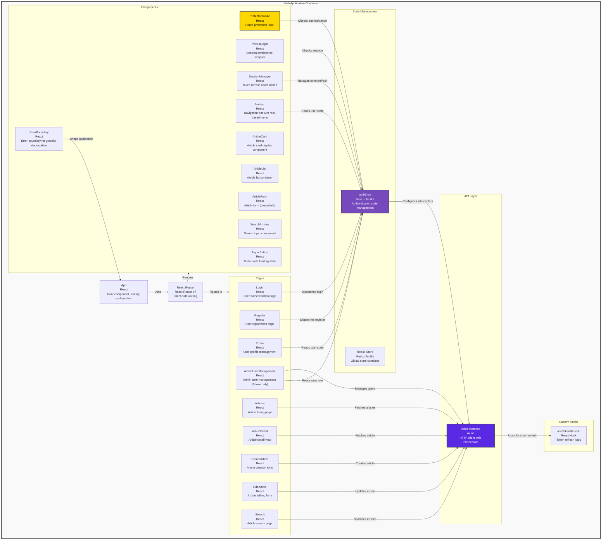

# C4 Level 3: Frontend Components

## Overview

This diagram shows the components within the Web Application container and their relationships.

## Diagram

## Components

### Application Layer

#### App (`src/App.js`)
- **Purpose**: Root component that configures routing and application structure
- **Responsibilities**:
  - Initialize Redux store connection
  - Configure React Router routes
  - Render global components (Navbar, SessionManager, ToastContainer)
  - Handle initial session restoration
  - Define protected route structure

#### React Router (`react-router-dom`)
- **Purpose**: Client-side routing and navigation
- **Routes**:
  - Public: `/login`, `/register`
  - Protected: `/profile`, `/articles`, `/articles/:id`, `/articles/create`, `/articles/:id/edit`, `/search`
  - Admin-only: `/admin/users`
- **Features**: Nested routes, route guards, programmatic navigation

### Page Components

#### Login (`src/pages/Login.js`)
- **Purpose**: User authentication interface
- **Features**:
  - Form validation
  - Error handling
  - Redirect on success
  - Integration with Redux authSlice

#### Register (`src/pages/Register.js`)
- **Purpose**: New user registration
- **Features**:
  - Form validation
  - Duplicate user detection
  - Success feedback
  - Auto-login after registration

#### Profile (`src/pages/Profile.js`)
- **Purpose**: User profile display and management
- **Features**:
  - Display user information (username, email, role)
  - Role-based UI rendering
  - Protected route (requires authentication)

#### Articles (`src/pages/Articles.js`)
- **Purpose**: Article listing with pagination
- **Features**:
  - Paginated article display
  - Article card rendering
  - Navigation to article details

#### ArticleDetail (`src/pages/ArticleDetail.js`)
- **Purpose**: Single article view
- **Features**:
  - Full article content display
  - Edit/Delete buttons (role-based)
  - Author information

#### CreateArticle (`src/pages/CreateArticle.js`)
- **Purpose**: Article creation form
- **Features**:
  - Form validation
  - Success/error handling
  - Redirect after creation

#### EditArticle (`src/pages/EditArticle.js`)
- **Purpose**: Article editing interface
- **Features**:
  - Pre-populated form
  - Update validation
  - Permission checking (owner or Moderator/Admin)

#### Search (`src/pages/Search.js`)
- **Purpose**: Article search interface
- **Features**:
  - Search input
  - Results display
  - Real-time search

#### AdminUserManagement (`src/pages/AdminUserManagement.js`)
- **Purpose**: User administration (Admin only)
- **Features**:
  - User list with pagination
  - Role modification
  - User deletion
  - RBAC enforcement (Admin role required)

### Reusable Components

#### Navbar (`src/components/Navbar.js`)
- **Purpose**: Global navigation bar
- **Features**:
  - Role-based menu items
  - Authentication status display
  - Logout functionality
  - Responsive design

#### ProtectedRoute (`src/components/ProtectedRoute.js`)
- **Purpose**: Route protection HOC
- **Features**:
  - Authentication check
  - Redirect to login if unauthenticated
  - Role-based access control (optional)

#### PersistLogin (`src/components/PersistLogin.js`)
- **Purpose**: Session persistence wrapper
- **Features**:
  - Token refresh on mount
  - Session restoration
  - Loading state handling

#### SessionManager (`src/components/SessionManager.js`)
- **Purpose**: Token refresh coordination
- **Features**:
  - Multi-tab session synchronization
  - Proactive token refresh
  - Page visibility handling
  - Automatic logout on refresh failure

#### ErrorBoundary (`src/components/ErrorBoundary.js`)
- **Purpose**: Error boundary for graceful degradation
- **Features**:
  - Catches React errors
  - Displays fallback UI
  - Error logging

#### ArticleCard (`src/components/ArticleCard.js`)
- **Purpose**: Article card display component
- **Features**:
  - Article preview
  - Click navigation
  - Responsive layout

#### ArticleList (`src/components/ArticleList.js`)
- **Purpose**: Article list container
- **Features**:
  - Pagination controls
  - Loading states
  - Empty state handling

#### ArticleForm (`src/components/ArticleForm.js`)
- **Purpose**: Reusable article form (create/edit)
- **Features**:
  - Form validation
  - Submit handling
  - Error display

#### SearchArticles (`src/components/SearchArticles.js`)
- **Purpose**: Search input component
- **Features**:
  - Search input
  - Debounced search
  - Results display

#### AsyncButton (`src/components/AsyncButton.js`)
- **Purpose**: Button with async operation handling
- **Features**:
  - Loading state
  - Disabled state during operation
  - Error handling

### State Management (Redux)

#### Redux Store (`src/redux/store.js`)
- **Purpose**: Global state container
- **Configuration**: Redux Toolkit with middleware
- **State Structure**:
  - `auth`: Authentication state (user, tokens, loading, error)

#### authSlice (`src/redux/slices/authSlice.js`)
- **Purpose**: Authentication state management
- **Actions**:
  - `login`: Async thunk for user login
  - `register`: Async thunk for user registration
  - `logout`: Synchronous action to clear auth state
  - `refreshUser`: Async thunk for session restoration
  - `setUser`: Synchronous action to set user data
- **State**:
  - `user`: Current user object (username, email, role)
  - `isAuthenticated`: Boolean flag
  - `loading`: Loading state
  - `error`: Error message

### API Layer

#### Axios Instance (`src/api/axiosInstance.js`)
- **Purpose**: HTTP client with interceptors
- **Features**:
  - Request interceptor: Adds auth headers
  - Response interceptor: Handles token refresh on 401
  - Error handling
  - Base URL configuration
  - Cookie support (`credentials: 'include'`)

### Custom Hooks

#### useTokenRefresh (`src/hooks/useTokenRefresh.js`)
- **Purpose**: Token refresh logic hook
- **Features**:
  - Automatic token refresh
  - Multi-tab coordination
  - Error handling

## Data Flow Example: User Login

1. **User Input**: User enters credentials in Login page
2. **Form Submission**: Login page dispatches `login` thunk from authSlice
3. **API Call**: authSlice → Axios Instance → POST `/api/login`
4. **Backend Response**: Tokens set in HttpOnly cookies
5. **State Update**: authSlice updates Redux store with user data
6. **UI Update**: Components re-render based on new auth state
7. **Navigation**: User redirected to `/profile`

## Data Flow Example: Article Creation

1. **User Input**: User fills article form in CreateArticle page
2. **Form Submission**: CreateArticle → Axios Instance → POST `/api/articles`
3. **Request Interceptor**: Axios adds access token from cookies
4. **Backend Response**: Article created, returns article ID
5. **Success Handling**: Page shows success message, redirects to article detail
6. **Error Handling**: Errors displayed via ToastContainer

## Design Patterns

- **Container/Presentational**: Pages are containers, components are presentational
- **Higher-Order Components**: ProtectedRoute, PersistLogin
- **Custom Hooks**: useTokenRefresh for reusable logic
- **Redux Toolkit**: Centralized state management with slices
- **Error Boundaries**: Graceful error handling
- **Axios Interceptors**: Centralized request/response handling

## Security Features

- **HttpOnly Cookies**: Tokens stored securely, not accessible via JavaScript
- **Automatic Token Refresh**: Seamless session management
- **Multi-tab Coordination**: Synchronized sessions across tabs
- **Role-Based UI**: Elements hidden based on user permissions
- **Protected Routes**: Unauthorized access prevented
- **Error Boundaries**: Prevents error propagation
