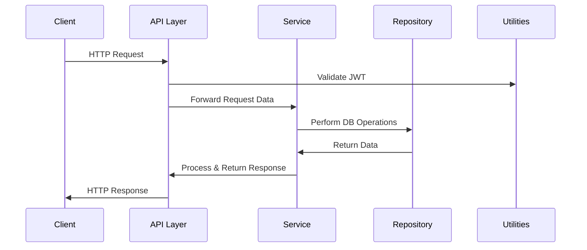

## Canvas API Documentation

### Overview
This document provides an updated overview of the Canvas API, including endpoint definitions, request and response schemas, error handling, and JWT-based authentication. It also includes updated design diagrams (architecture, component interaction, and data flow) to illustrate the internal application structure.

---

## Endpoints

### 1. Home
- **Route**: `/`
- **Method**: `GET`
- **Description**: Returns a simple welcome message confirming that the API is operational.
- **Response**:
  - **200 OK** – `{"message": "Welcome to Canvas API"}`

### 2. User Registration
- **Route**: `/api/register`
- **Method**: `POST`
- **Description**: Accepts user details (e.g., username, password, and other profile data) and registers a new user.
- **Request Body** (JSON):
  ```json
  {
    "username": "string",
    "password": "string",
    "email": "string",
    "...otherFields": "..."
  }
  ```
- **Response**:
  - **201 Created** – `{"message": "User registered successfully"}`
  - **400 Bad Request** – Returned if request data is invalid or missing.

### 3. User Login
- **Route**: `/api/login`
- **Method**: `POST`
- **Description**: Authenticates user credentials and issues JWT tokens.
- **Request Body** (JSON):
  ```json
  {
    "username": "string",
    "password": "string"
  }
  ```
- **Response**:
  - **200 OK** – Returns two JWT tokens (access and refresh) by default, often set via cookies or returned in the response body.
  - **401 Unauthorized** – Invalid credentials.

### 4. Refresh Token
- **Route**: `/api/refresh`
- **Method**: `POST`
- **Description**: Refreshes the user’s access token using a valid refresh token.
- **Response**:
  - **200 OK** – Returns a new access token.
  - **401 Unauthorized** – Missing or invalid refresh token.

### 5. Retrieve Articles
- **Route**: `/api/articles`
- **Method**: `GET`
- **Description**: Retrieves a paginated list of articles.
- **Query Parameters**:
  - `page`: integer representing the page number (optional)
  - `limit`: integer specifying how many articles per page (optional)
- **Response**:
  - **200 OK** – JSON list of articles with pagination metadata.

### 6. Create Article
- **Route**: `/api/articles`
- **Method**: `POST`
- **Description**: Creates a new article. Requires a valid access token (authenticated user).
- **Request Body** (JSON):
  ```json
  {
    "title": "string",
    "content": "string",
    "tags": ["string", ...]
  }
  ```
- **Response**:
  - **201 Created** – Returns the newly created article resource.
  - **401 Unauthorized** – Missing or invalid JWT.
  - **400 Bad Request** – Invalid or incomplete article data.

### 7. Article Management
- **Route**: `/api/articles/<article_id>`
- **Methods**: `GET`, `PUT`, `DELETE`
- **Description**:
  - **GET** – Retrieves a single article by its ID.
  - **PUT** – Updates an existing article. Requires authentication.
  - **DELETE** – Deletes an existing article. Requires authentication.
- **Parameters**:
  - `article_id`: The ID of the article to get, update, or delete.
- **Response**:
  - **200 OK** – Successfully fetched or updated the article.
  - **204 No Content** – Successfully deleted the article.
  - **404 Not Found** – Article does not exist.
  - **401 Unauthorized** – Missing or invalid JWT.

### 8. User Logout
- **Route**: `/api/logout`
- **Method**: `POST`
- **Description**: Logs out the user by invalidating the current session or JWT (depending on the implementation).
- **Response**:
  - **200 OK** – Confirmation message indicating successful logout.

---

## Error Handling and Response Codes
The application handles errors consistently, returning JSON responses. Common error responses include:

| Status Code | Meaning                             | Example JSON                                   |
|------------:|:------------------------------------|:----------------------------------------------|
| 400         | **Bad Request**                     | `{"error": "Invalid request payload"}`      |
| 401         | **Unauthorized**                    | `{"error": "Missing or invalid JWT token"}` |
| 404         | **Not Found**                       | `{"error": "Resource not found"}`           |
| 500         | **Internal Server Error**           | `{"error": "An unexpected error occurred"}` |

Error handlers in **app/routes.py** catch exceptions and return the appropriate HTTP code along with an informative JSON body.

---

## Authentication and JWT Details
The Canvas API issues [JWT (JSON Web Token)](https://jwt.io/) for access control.

- **Token Types**:
  - **Access Token**: Short-lived token (e.g., 15 minutes). Used for accessing protected endpoints.
  - **Refresh Token**: Longer-lived token (e.g., 7 days or more). Used to obtain new access tokens.
- **Generation**:
  - Upon successful login, both tokens are generated. Access tokens are typically stored in memory or cookies, whereas refresh tokens are usually set in an httpOnly cookie.
- **Usage**:
  - Include the access token in the `Authorization: Bearer <access_token>` header or rely on it being set via cookies.
  - Use the refresh token at `/api/refresh` to get a new access token.
- **Cookie-based Authentication**:
  - The server may set cookies named `access_token` and `refresh_token`. Ensure your client is configured to send cookies if you leverage cookie-based auth.

---

## Swagger Integration
Swagger UI is served at `/api/docs`, reading specifications from `app/static/swagger.json`. Update **swagger.json** to reflect:
- **New or Modified Endpoints**
- **Request/Response Schemas** (particularly for user registration, article creation/update)
- **Authentication Requirements** for protected endpoints

Include any relevant examples or definitions under the `components/schemas` section to standardize request/response structures.

---

## Design Diagrams

### Current Architecture Diagram
Below is a Mermaid diagram illustrating the updated decoupled architecture:

```mermaid
graph TD
    A[Flask App (Routes)]
    B[API Layer]
    C[Service Layer]
    D[Repository Interface]
    E[MongoDB Repository Implementations]
    F[Shared Utilities]

    A --> B
    B --> C
    C --> D
    D --> E
    C --- F
    B --- F
```

- **Flask App (Routes)**: Defines URL endpoints.
- **API Layer**: Responsible for request validation and response construction.
- **Service Layer**: Contains core business logic.
- **Repository Interface**: Defines data access contracts.
- **MongoDB Repository Implementations**: Concrete classes that implement data operations.
- **Shared Utilities**: Common library (logging, error handling, etc.) accessible to both API Layer and Service Layer.

### Component Interaction Diagrams

- **Services**: Interact with the **Repository Interface** to fetch or persist data. Services also coordinate with **Shared Utilities** (e.g., logging, custom error classes).
- **APIs**: Call the relevant service methods, handle request/response transformations, and implement additional authentication or rate-limiting logic.

An illustrative sequence diagram (example only):



### Data Flow Diagrams
A simplified data flow diagram showcasing a typical request:

1. **Client** sends a request (with JWT if required) to `/api/...`.
2. **Flask App** routes the request to the appropriate endpoint in **API Layer**.
3. **API Layer** validates input, checks authentication, and calls the **Service Layer**.
4. **Service Layer** runs business logic, delegates data operations to the **Repository Interface**.
5. **Repository** performs the necessary CRUD operations on the **MongoDB**.
6. **Service Layer** returns the results or errors back to the **API Layer**.
7. **API Layer** transforms the response as necessary and sends it back to the **Client**.
8. **Shared Utilities** like the logger track relevant events, and custom error handling ensures consistent error responses.

---

## Conclusion
This documentation outlines the updated endpoints, error responses, authentication flow using JWT, and the new decoupled architecture. For ongoing maintenance, ensure the Swagger definition stays in sync with your application’s routes and data models.

